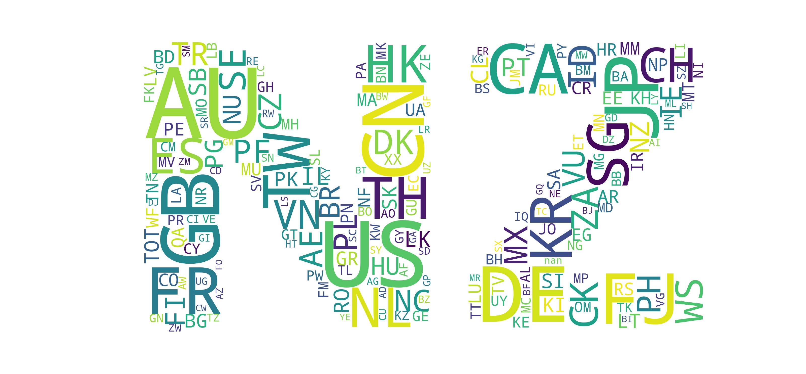
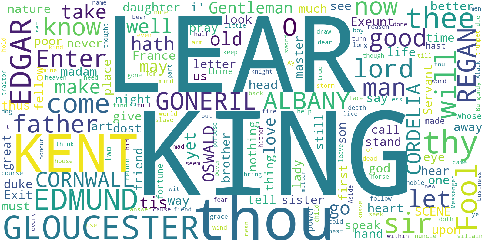
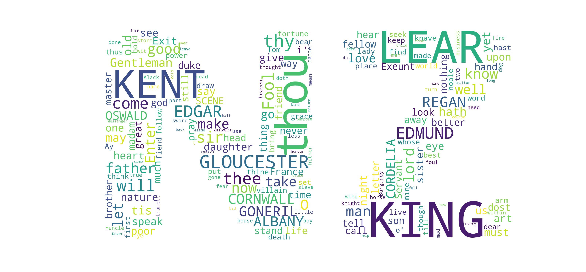

# word-cloud-etl

Generate wordcloud images from a data file: raw text, CSV or Parquet.

## Examples

### Reading from a Parquet file:

- Countries trading with New Zealand

```
pipenv run python main.py examples\NZ_trade.parquet   country_code     images\mask.small.png
```


... adding a mask:


### Reading from a CSV file:

```
pipenv run python main.py examples\NZ_trade.csv   country_codez     images\mask.small.png
```


... adding a mask:


### Reading from a raw text file:

```
pipenv run python main.py examples\king_lear.txt   word     images\mask.small.png
```


... adding a mask:


## Setup

```shell
pipenv install
pipenv shell
python main.py <path to parquet file> <word column name>
```

## References

- https://amueller.github.io/word_cloud/
- https://amueller.github.io/word_cloud/auto_examples/index.html#example-gallery
- https://medium.com/mlearning-ai/wordclouds-with-python-c287887acc8b
